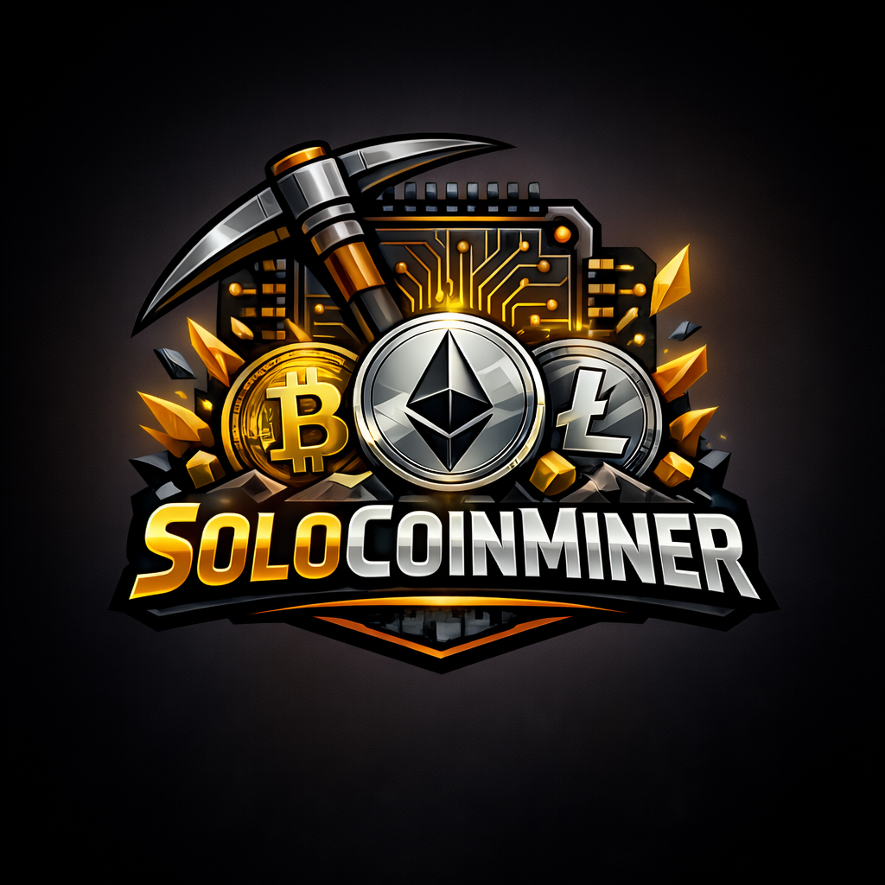

# solocoinminer (SHA-256 + PoW local, Stratum, Solo RPC)



Implementação em C de mineração SHA-256 com modos local, Stratum (pool) e solo via RPC (node). A UI WPF integra controle de modo, carteira local e monitoramento.

---

## Requisitos

- CMake 3.16+
- Ninja ou outro gerador suportado
- Compilador C11 (MSVC, clang ou gcc)

---

## Build

```bash
cmake -S . -B build -G Ninja -DCMAKE_BUILD_TYPE=Release
cmake --build build
No Windows, execute os comandos acima no PowerShell dentro de um Developer Prompt do Visual Studio Build Tools.
```
Uso (CLI)
# Sintaxe: ./coinminer <comando> [opções]

# Executar o minerador (opcional: --progress 50000). Modo sempre infinito (pare com Ctrl+C).
./build/coinminer run "hello" 4 0 --progress 50000

# Benchmark (medir hashrate)
./build/coinminer bench 500000 --progress 100000

# Carteira (criar/mostrar saldo)
./build/coinminer wallet --wallet wallet.dat

# Stratum (pool) com SHA-256 + submit de shares
./build/coinminer stratum pool.exemplo.com 3333 worker userpass --coin bitcoin

# Solo via RPC (node local)
./build/coinminer solo 127.0.0.1 8332 rpcuser rpcpass --coin bitcoin

# Versão
./build/coinminer version

# Ajuda
./build/coinminer help
Parâmetros
data: string base que será concatenada com o nonce.

dificuldade_hex: número de zeros à esquerda (em hexadecimal) exigidos no hash (0–64).

max_tentativas: ignorado no modo infinito (0). Pare manualmente com Ctrl+C.

iteracoes: quantidade de hashes para medir hashrate (benchmark), padrão 500000.

--progress N: exibe progresso a cada N tentativas (run) ou hashes (bench).

--wallet caminho: define o arquivo de carteira (padrão: wallet.dat).

--reset-wallet: recria a carteira (novo endereço, saldo zerado).

Carteira
Arquivo simples (wallet.dat por padrão) contendo endereço, saldo e blocos minerados (modo local).

No modo Stratum/solo, o pagamento depende do endereço configurado no pool/node.

Stratum (pool)
Comando:
stratum <host> <port> <user> [password] [--retries N] [--delay SECS] [--coin NAME]
Faz subscribe/authorize, processa notify e difficulty, e tenta submeter shares.

Usa target por difficulty do pool (mining.set_difficulty) quando disponível.

Solo (node RPC)
Comando:

solo <host> <port> <user> <password> [--coin NAME]
Usa getblocktemplate e submitblock via RPC.

Requer node local ativo (bitcoind, litecoind ou dogecoind) com RPC habilitado.

Interface (WPF)
Projeto WPF em ui/ com dashboard, modo Local/Stratum/Solo, carteira local e controle Start/Stop.

Abra ui/Coinminer.Ui.sln no Visual Studio para executar.
